

  

<h1 align="center">Lumma</h1>

An AI-native diary app for your inner reflections

  <strong>Journal freely. Reflect deeply. Powered by AI.</strong>

 

> As a heavy Obsidian user, I love journaling. But Obsidian’s mobile experience is lacking, especially for AI-based plugins.
> That’s why I built Lumma with Flutter—to create a seamless, mobile-first journaling experience.

## Screenshots

  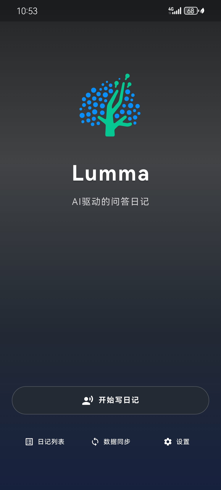
  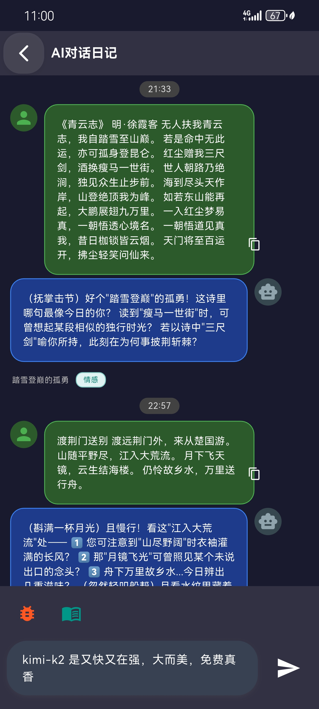
  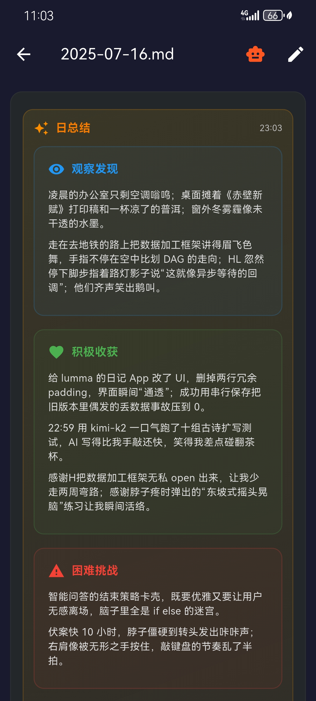
  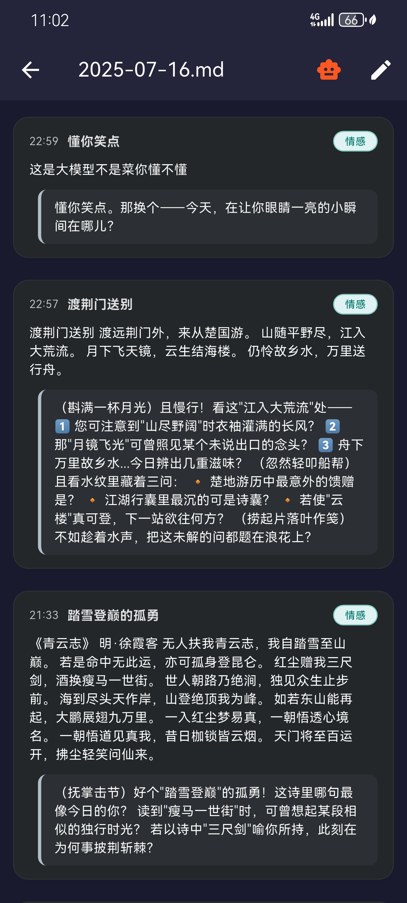

  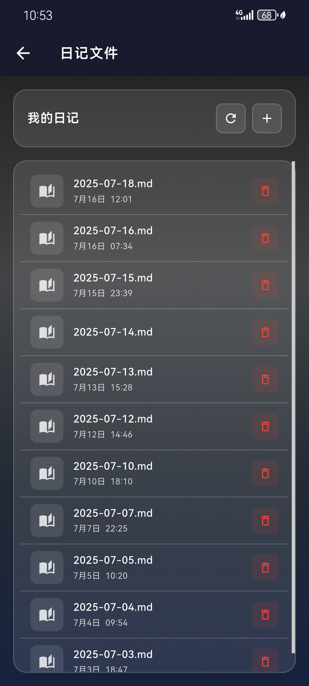
  
  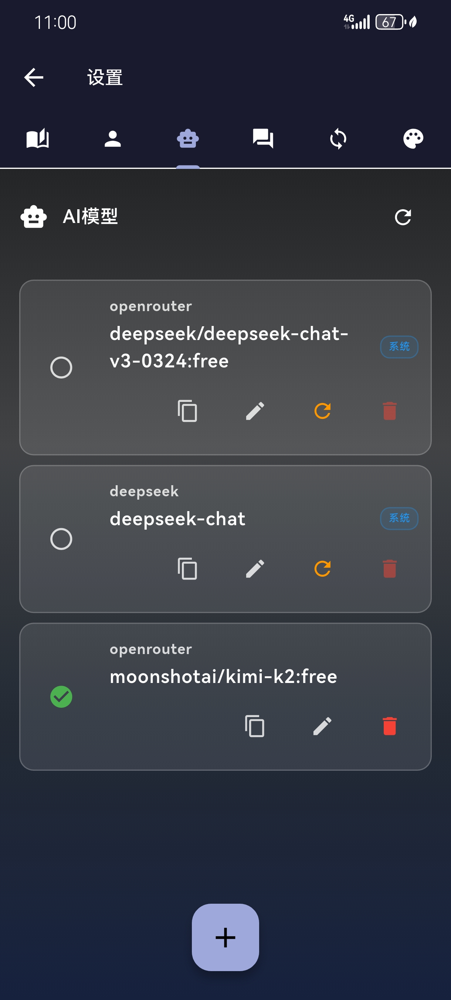
  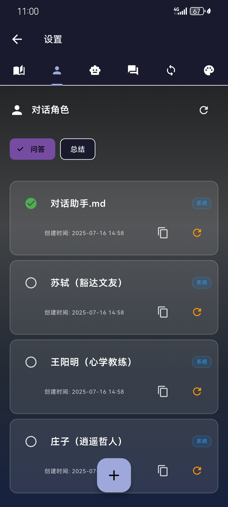

  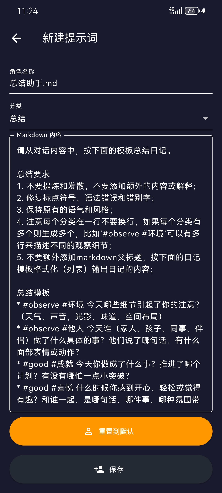
  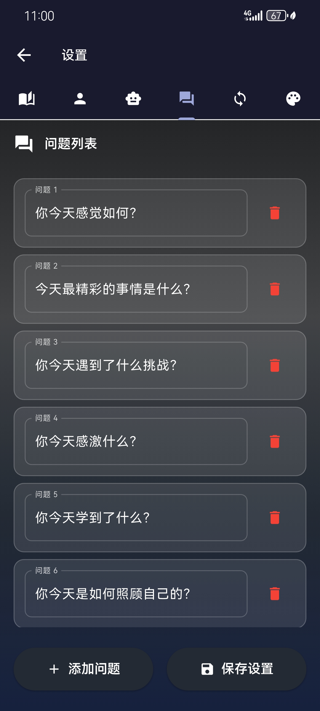
  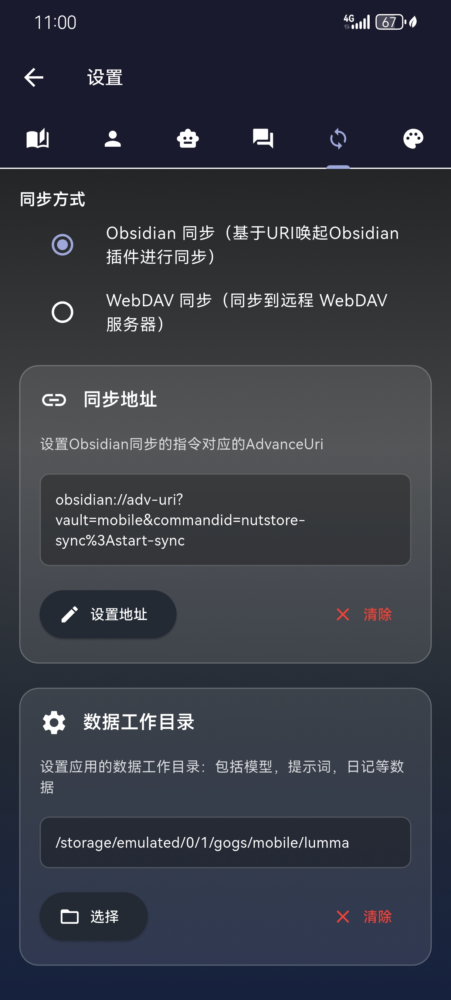
  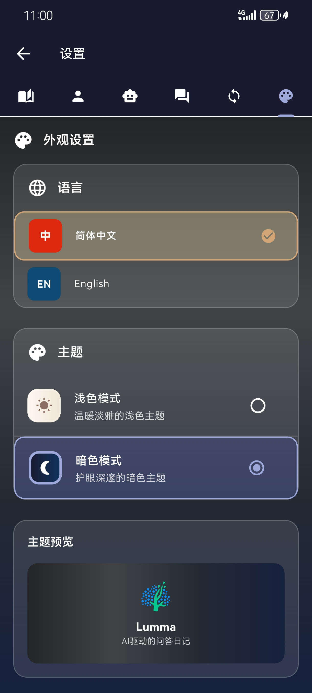

## ✨ Key Features

### 📝 Smart Journaling Modes

- **Q&A Mode**: Answer guided prompts that help you reflect on your day—your observations, emotions, challenges, and insights
- **Chat Mode**: Talk freely with the AI, just like having a supportive conversation with a friend

### 🤖 Built-in AI Capabilities

- Support for multiple LLM backends
- Auto-generated journal entries and summaries
- Smart title and tag extraction
- Fully customizable prompts and conversation styles

### 💾 Secure and Syncable

- All journals are saved locally in Markdown format
- Supports WebDAV for cloud backup and sync
- Compatible with Obsidian sync via Advanced URI

## 🛠 How It Works

Use voice input (e.g. via WeChat keyboard) to capture your thoughts.
Lumma uses AI to structure the content into clean Markdown files, ready to sync with your Obsidian vault.
