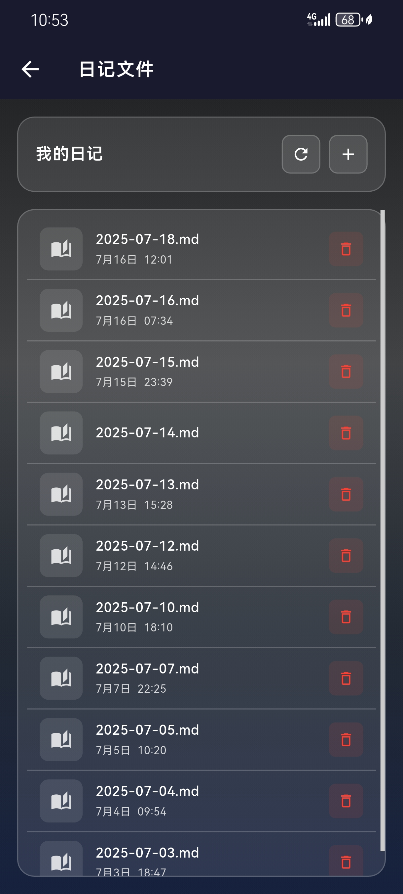
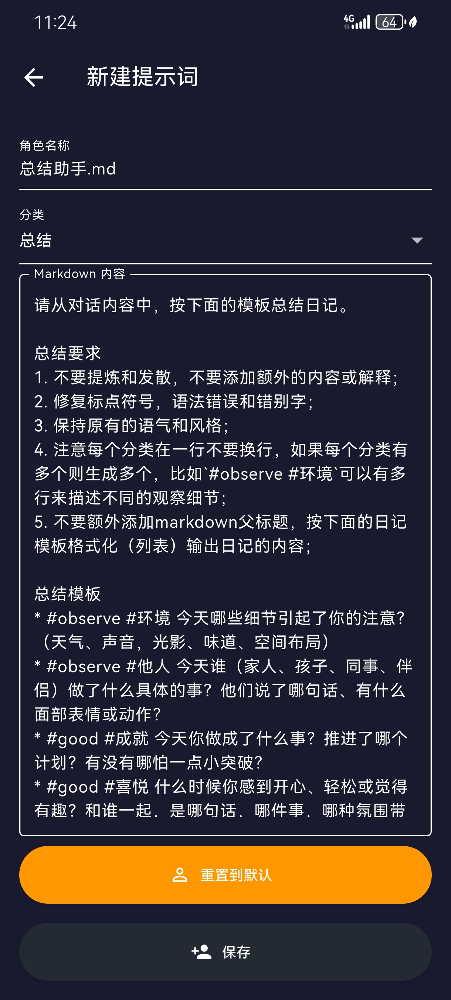

  

  # Lumma

  [English Version](./README.md)

  **AI原生的问答式日记应用**

  <strong>日有所记，问有所思；心有所感，自得其解。</strong>

> 作为一名重度 Obsidian 用户，我热爱写日记。但在移动端，Obsidian 的体验不佳，AI 插件更难使用。于是我基于 Flutter 自研了这款 App，打造更顺畅的移动端日记体验。

## 功能截图

  
  
  
  

  
  
  
  

  
  
  
  

## ✨ 核心亮点

### 📝 智能日记模式

- **问答模式（Q&A）**：通过预设问题引导记录，快速聚焦每日观察、情绪、挑战与反思
- **聊天模式（Chat）**：像朋友一样对话，与 AI 自由交流内心感受

### 🤖 强大的 AI 能力

- 支持多种主流大语言模型（LLM）接入
- 自动生成问答式日记与摘要
- 智能提取标题与分类标签
- 支持自定义提示词和对话风格

### 💾 数据安全与同步

- 所有日记本地持久化为 Markdown 格式
- 支持 WebDAV 云端同步
- 支持通过 Advanced URI 触发 Obsidian 自动同步

## 🛠 使用方式
我目前的使用方式如下：
1. 手机端在Lumma通过微信语音输入记录日记内容，AI自动结构化（分类打标）生成日总结；
2. 基于Obsidian客户端或者Webdav插件同步到Obsidian电脑端；
3. 在Obsidian电脑端使用QuickAdd的template将日总结提取到对应的日记内（手机端只作为临时输入）；
4. 周总结按标签汇总统计日记内容
